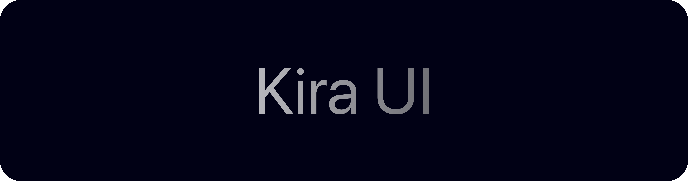
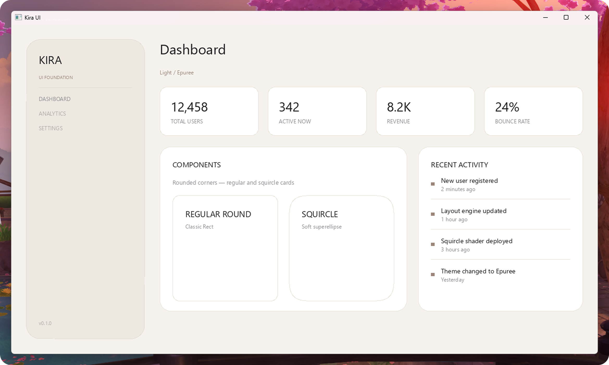

<picture>
  <source media="(prefers-color-scheme: dark)" srcset="Images/KiraUIBannerDark.png">
  <source media="(prefers-color-scheme: light)" srcset="Images/KiraUIBannerLight.png">
  
</picture>

# Kira UI

A high-level declarative widget layer for the Kira programming language. Build GPU-accelerated applications with a composable widget tree, modifier chains, and a rich material system — all in clean, readable Kira code.

```kira
import KiraUI

RunWidgetApp(
    VStack(spacing = 12.0) {
        Text("Hello, Kira UI!")
            .font(size = 24.0, weight = FontWeight.Bold)
            .textColor(Color.White)

        Card(material = Material.Frosted) {
            Text("Frosted glass card")
        }
    }
    .padding(20.0)
)
```

Built on [Kira UI Foundation](https://github.com/kira-lang-com/ui-foundation) — a retained-tree rendering engine with identity-based reconciliation, dirty flags, and deterministic teardown — Kira UI gives you a familiar SwiftUI-like API without templates or bindings.

## Showcase

<picture>
  <source media="(prefers-color-scheme: dark)" srcset="Images/KiraUIShowcaseSundayAI.png">
  <source media="(prefers-color-scheme: light)" srcset="Images/KiraUIShowcaseSundayAI.png">
  
</picture>

[basic-demo](Examples/basic-demo) — a full app built with Kira UI demonstrating cards, frosted glass, custom surfaces, and composable widget trees.

## Widgets

- **Text** — styled text with configurable size, weight, and color
- **VStack / HStack** — vertical and horizontal layouts with spacing, padding, and alignment
- **VStackFill / HStackFill / HStackStretch** — layout variants for fill or stretch modes
- **Surface** — configurable container with fill, border, radius, shape, material, and effects
- **Card** — pre-styled surface with material-aware fill, border, glow, and clip
- **AppSurface** — full-screen root surface with padding
- **Spacer** — flexible expanding space with configurable flex
- **Circle** — squircle shape primitive
- **Divider** — horizontal line separator
- **LinearGradient** — multi-strip gradient between two colors

## Modifiers

Chain modifiers onto any widget for declarative customization:

| Modifier | Description |
|----------|-------------|
| `.padding(length)` | Uniform padding |
| `.background(fill)` | Layer a fill widget behind content |
| `.cornerRadius(radius)` | Rounded corners with clip |
| `.blurBehind(radius, saturation)` | Glass blur effect |
| `.glow(intensity)` | Outer glow |
| `.font(size, weight)` | Text font and weight |
| `.opacity(value)` | Transparency |
| `.fill(color)` | Surface fill color |
| `.textColor(color)` | Text color |
| `.size(value)` / `.width(value)` / `.height(value)` | Fixed dimensions |
| `.minWidth(value)` | Minimum width |
| `.fillHeight()` | Expand to fill available height |
| `.surfaceRadius(value)` | Surface corner radius |
| `.surfacePadding(value)` | Surface inner padding |
| `.surfaceShape(shape)` | RegularRoundedRect or Squircle |
| `.surfaceBorder(color, width)` | Surface border |

## Project Structure

```text
app/
├── KiraUI.kira        # Entry points (RunWidgetApp, RunKiraApp)
├── Modifiers.kira     # Widget modifier extensions
└── WidgetModel.kira   # Core widgets, color system, and lowering logic
```

## Getting Started

Install the [Kira SDK](https://github.com/kira-lang-com/kira) and [Kira UI Foundation](https://github.com/kira-lang-com/ui-foundation), then:

```bash
cd Examples/basic-kira-ui-app
kira run
```

## Colors

Preset colors for common UI needs — White, Beige, Taupe, Green, Blue, Purple, Cyan, Yellow, plus text and border variants (DarkText, SecondaryText, MutedText, BorderSoft, MutedGreen, MutedBlue, MutedOrange).

## Materials

Surfaces and cards support three material modes:

- **Flat** — solid opaque surface
- **Frosted** — blur-behind glass effect
- **LayeredGlass** — multi-layer glass with glow

## Ecosystem

Kira UI is part of the Kira language ecosystem:

- [Kira](https://github.com/kira-lang-com/kira) — the language compiler & VM
- [Kira UI Foundation](https://github.com/kira-lang-com/ui-foundation) — retained-tree rendering foundation
- [KiraGraphics](https://github.com/kira-lang-com/kira-graphics) — GPU graphics backend
- [KiraLayout](https://github.com/kira-lang-com/kira-layout) — two-pass layout engine

## License

Apache License 2.0. See `LICENSE`.
